## Overview
​    Today, there are strong research interests on applying data-driven machine learning (ML) approaches to design new MAC protocols for wireless networks. However, most of the existing designs used simulations to generate "man-made" wireless data to feed their constructed ML models. Therefore, it is hard to predict the performances of these ML models in real wireless networks. To fill this gap, we build this dataset called WSS24 that contains real wireless data sampled from the 2.4 GHz frequency band. Our aim is to make this dataset a good database for researchers who want to try data-driven ML on real wireless data while spending minimal efforts on collecting the data. And we believe that this dataset of real wireless data is very helpful to evaluate the effectiveness of data-driven ML approaches in real wireless networks and thus it is helpful to guide the design of wireless MACs using data-driven ML approaches. The procedure of collecting the raw wireless data is described in this part. Since the signal-to-interference-plus-noise ratio (SINR) is a common indicator of the wireless channel quality, it is often used as an evidence for the actions in wireless PHY and MAC layers. In our project, we adopt an accessible link metric, i.e., the received signal strength indicator (RSSI) that can be served as a proxy for the real SINR. We used Ellisys Bluetooth Vanguard spectrum analyzer (BV1) to capture and measure RSSI values on the 2.4GHz frequency band. The sampling interval we set is 100us and the sampling duration time is 5 minutes. The sampling was performed on each 1MHz band from 2.401GHz to 2.483GHz. 

​    We conducted data sampling at two different indoor scenarios, i.e., our Lab at Shenzhen University and the check-in hall at the terminal 4 of Shenzhen Bao’an International Airport. Fig. 1 and 2 show the layouts of the two wireless sampling scenarios, respectively. In our Lab, there are 12 APs and 8 BT/BLE devices deployed and we used BV1 to sample RSSI at the sensor position, as shown in Fig. 1. At the airport terminal hall, we directly sampled RSSI at 5 locations, i.e., check-in counters B, D, E, G, and the lounge, as shown in Fig. 2. Note that, when we used BV1 to sample the raw RSSI data on the 2.4GHz frequency band at the airport, the collected raw data will include all potential signals from the wireless networks working on this band at the airport. Fig. 3 presents our sampling equipment. The sampled raw data are saved as CSV files that can be downloaded from the project page at GitHub.

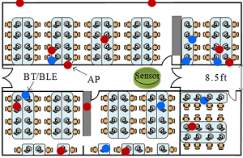

Fig. 1 The layout of our Lab at Shenzhen University

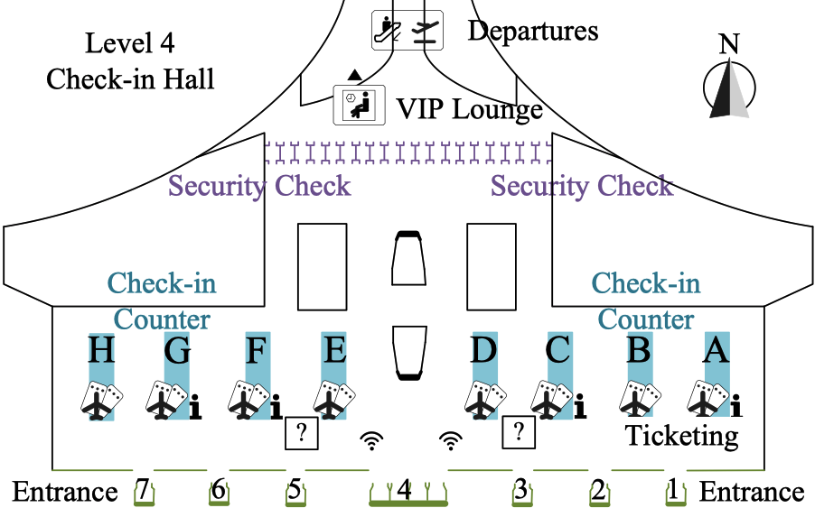

    Fig. 2 The layout of the check-in hall of Shenzhen Baoan International Airport

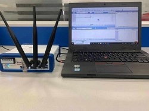

    Fig. 3 Photograph of sampling equipment

## Data Set Format

​    We provide here as an example of how we process the sampled raw RSSI data. The available 2.4GHz frequency band used by 802.11 Wi-Fi networks in most parts of the world is from 2.401GHz to 2.483GHz, which can be divided into N = 83 sub-bands each with a bandwidth of 1MHz. We denote the n-th 1MHz sub-band by

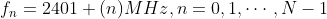

​    We can collect the raw data by sampling the RSSI on each sub-band with an equal sampling interval for a certain sampling duration. When we sample the RSSI on each of the sub-bands, we set the sampling interval to Ts = 100µs for a sampling duration that consists of L RSSI samples. The all data of the sampled raw RSSI on N sub-bands can be collected into the following raw RSSI matrix:

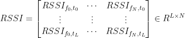

where RSSIfn, teis the (*n,e*)-th entry of the raw RSSI matrix, f0 is the sampling starting time,   te = t0 + tsk, k = 0,1, ... , L is the e-th sampling time, and  fi represents the *i*-th sub-band. Fig. 4 presents the measured RSSI in 0.1 second at Shenzhen Baoan International Airport.

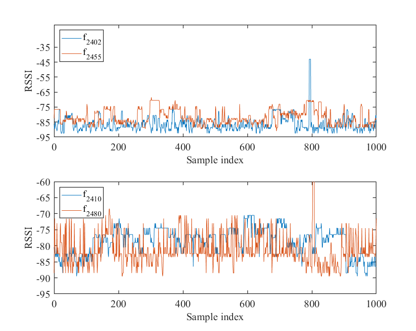

    Fig. 4 The measured RSSI in 0.1 second at Shenzhen Baoan International Airport

## Data Processing

​    The raw data contains a very large amount of channel information, but in order to use the data in a more targeted way, we need to process the data.

​    First, we deal with the RSSI samples in the time domain. The time length of one RSSI sample is Ts = 100µs, but the time length of one mini-slot in the CSMA/CA protocol of Wi-Fi networks is Tslot = 100µs. To align with the time units of CSMA/CA and our data, we perform up-sampling via the linear interpolation with an up-sampling factor Ts/Tslot ≈ 11. In particular, the RSSI interpolation on sub-band fn given by

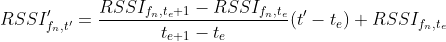

where t' is the time index of the interpolated RSSI between the RSSI samples at time fe and fe+1, and RSSI'fn,t' is the result of interpolation at t' on sub-band fn.

​    After the time-domain data processing, we also have frequency-domain data processing. There are 14 overlapping and staggered channels on the 2.4GHz frequency band, and the first 13 channels are widely used in most parts of the world. Therefore, we only consider the first 13 channels in dataset. Similarly, we need to interpolate RSSI values on sub-bands into the M = 13 Wi-Fi channels, as shown in Fig. 5. The m-th channel’s center frequency of Wi-Fi networks can be written as

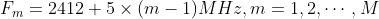

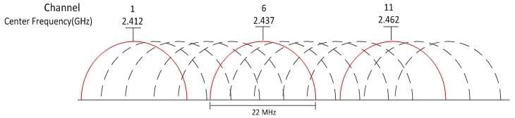

    Fig. 5 The illustration of interpolating RSSI values o the 83sub-bands into the 13 Wi-Fi channels.

​    We perform down-sampling via average interpolation with a down-sampling factor of 23. Consider channel 6 as an example. The 2.437GHz is the center frequency of channel 6 that occupies the 23 sub-bands from 2.426GHz to 2.448GHz (f25,· · · , f47). We calculate the average of the RSSI values sampled from these 23 sub-bands as the interpolated RSSI value of channel 1. In particular, we can express the interpolated RSSI of channel m at time te as

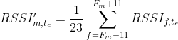

​    Finally, the RSSI matrix obtained after the time and frequency domain processing is shown below:

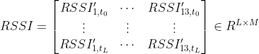

## Spectrum Data Set Analysis

### Heap Map
​    After processing the data, we obtained a two-dimensional RSSI matrix given by (6) for each sampling locations. We now have 6 RSSI matrices that contain the data sampled at the counter B, D, E, G, and the Lounge of airport check in hall, the data sampled at our Lab. In order to visually understand the data, we display the data in the form of heat maps. The head maps of the 6 RSSI matrices are given in Fig 6-11, where the vertical direction represents the Wi-Fi channels, the horizontal direction represents the time (we only shows the data within a 1 second time window). 

      Fig. 6 The RSSI heat map of data sampled at counter B of the airport
  

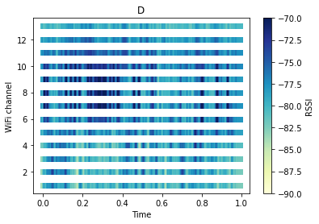

      Fig. 7 The RSSI heat map of data sampled at counter D of the airport
  

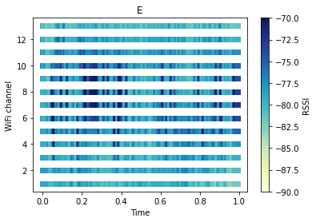

      Fig. 8 The RSSI heat map of data sampled at counter E of the airport
  
										

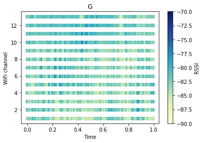

    Fig. 9 The RSSI heat map of data sampled at counter G of the airport
  

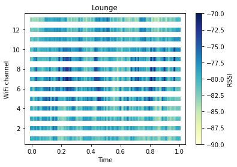

      Fig. 10 The RSSI heat map of data sampled at VIP Lounge of the airport
  

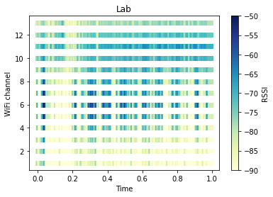

      Fig. 11 The RSSI heat map of data sampled at Laboratory
  

​    From these heat maps, we can observe that at the airport, the Wi-Fi channels were always occupied by wireless signals and there are not too many free time slots for all Wi-Fi channels; in contrast, at our Lab, there are many free time slots that are not occupied by wireless signals for some Wi-Fi channels, which is due to the fact that the number of wireless devices used in the Lab is far less than that in the airport. .

## Download

​    Some of the original samples have been uploaded to this github repository, such as B.csv, C.csv, D.csv and G.csv. The remaining data need to be downloaded from the web site.
 https://emailszueducn-my.sharepoint.com/:f:/g/personal/2176269105_email_szu_edu_cn/EkXCLxigvhFDiUFDhT-6YkwBGAAgLr4XBOezZxABJ9RXXw

## Acknowledgements
​    We are grateful to Huawei's 2012 Labs for providing us with technical support and Shenzhen Baoan International Airport for providing us with a test site.

## Publications

​    More than our own work, we are excited about *others* using our dataset for scientific research. We are proud to list the following published papers using our data.

* [Deep Learning for Intelligent Wireless MAC: Exploiting Real Data Sampled on 2.4GHz Frequency Band](https://arxiv.org/pdf/2106.10307.pdf)

* AI-Aided Channel Quality Assessment for Bluetooth Adaptive Frequency Hopping (IEEE PIMRC 2021.)

## Contributors

Jiantao Xin1, Wensen Xu1, Yucheng Cai1, Taotao Wang1, Shengli Zhang1, Peng Liu2, Ziyang Guo2, Jiajun Luo2
1College of Electronics and Information Engineering, Shenzhen University, Shenzhen, China
2Wireless Technology Lab, 2012 Laboratories, Huawei, China.  

## Contact Us
* Email: ttwang@szu.edu.cn

## Terms of Use:
1. This data set is licensed by Shenzhen University. Copyright Shenzhen University 2021. 

2. Attribute the data as the "Wireless Signal Strength on 2.4GHz dataset" or "WSS24" for short, and the url: https://github.com/postman511/Wireless-Signal-Strength-on-2.4GHz-WSS24-dataset.  

